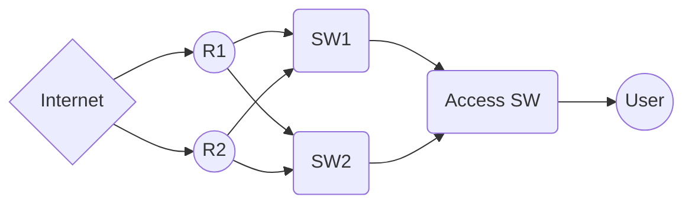

<B>Create new telegram bot</B>

Creating a new bot 
Use the /newbot command to create a new bot. The BotFather will ask you for a name and username, then generate an authorization token for your new bot.

The name of your bot is displayed in contact details and elsewhere.

The Username is a short name, to be used in mentions and telegram.me links. Usernames are 5-32 characters long and are case insensitive, but may only include Latin characters, numbers, and underscores. Your bot's username must end in ‘bot’, e.g. ‘tetris_bot’ or ‘TetrisBot’.

The token is a string along the lines of 110201543:AAHdqTcvCH1vGWJxfSeofSAs0K5PALDsaw that is required to authorize the bot and send requests to the Bot API. Keep your token secure and store it safely, it can be used by anyone to control your bot.

https://core.telegram.org/bots#creating-a-new-bot

<B>Telegram Bot - how to get a group chat id?</B> 

Assume the bot name is my_bot.

1- Add the bot to the group.
Go to the group, click on group name, click on Add members, in the searchbox search for your bot like this: @my_bot, select your bot and click add.

2- Send a dummy message to the bot.
You can use this example: /my_id @my_bot
(I tried a few messages, not all the messages work. The example above works fine. Maybe the message should start with /)

3- Go to following url: https://api.telegram.org/botXXX:YYYY/getUpdates
replace XXX:YYYY with your bot token

4- Look for "chat":{"id":-zzzzzzzzzz,
-zzzzzzzzzz is your chat id (with the negative sign).

5- Testing: You can test sending a message to the group with a curl:

curl -X POST "https://api.telegram.org/botXXX:YYYY/sendMessage" -d "chat_id=-zzzzzzzzzz&text=my sample text" 
If you miss step 2, there would be no update for the group you are looking for. Also if there are multiple groups, you can look for the group name in the response ("title":"group_name").

Hope this helps.

